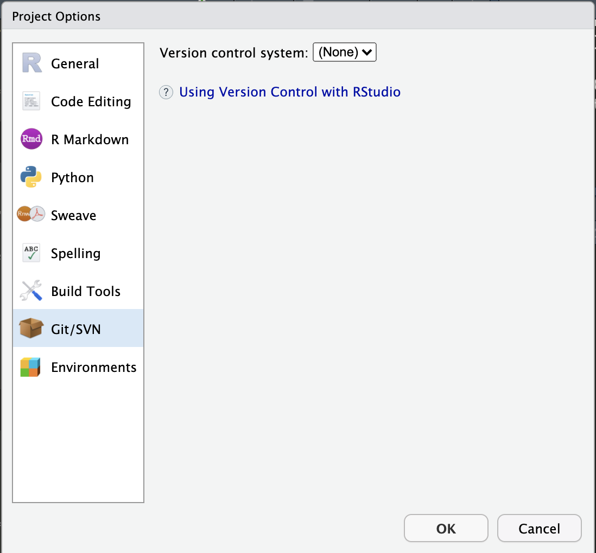
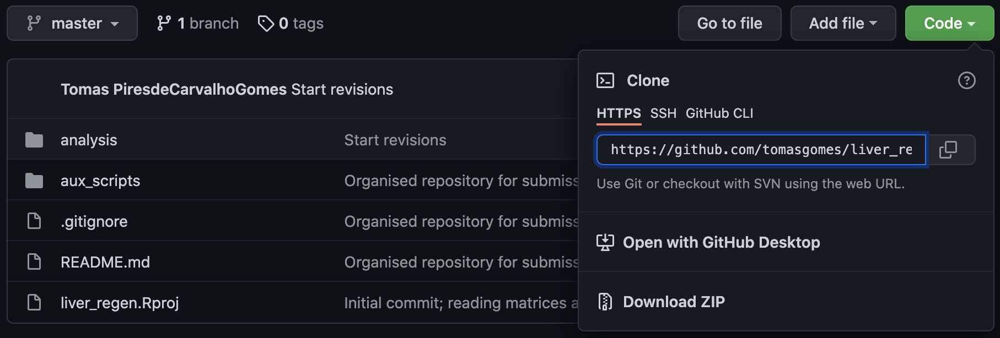
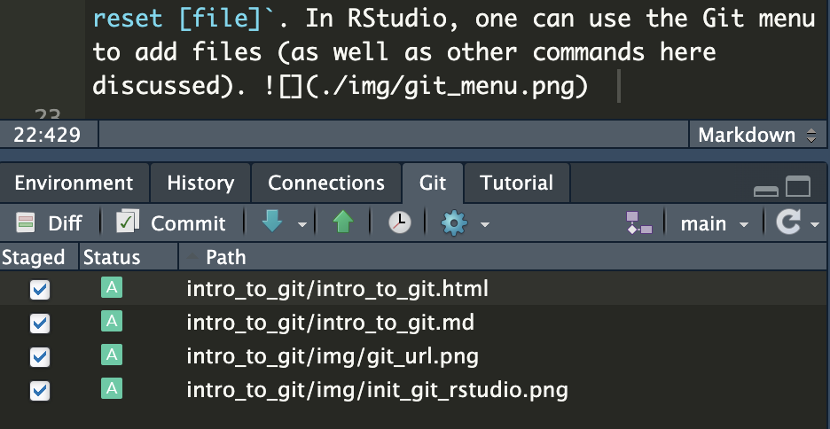
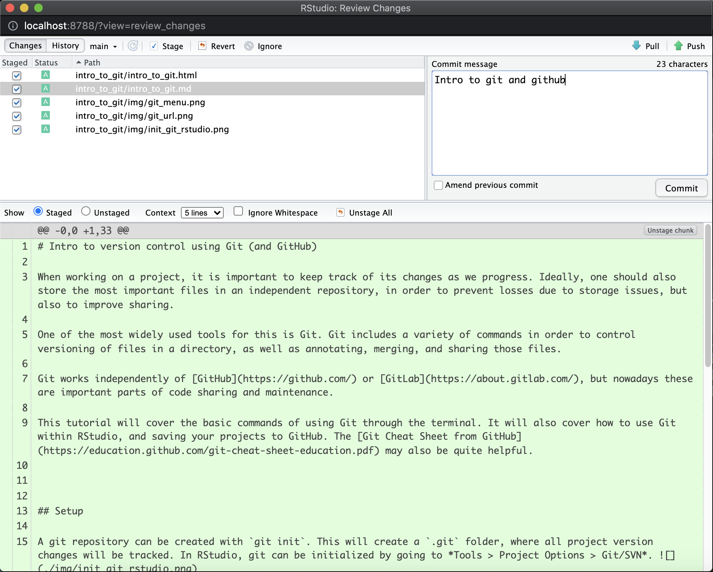
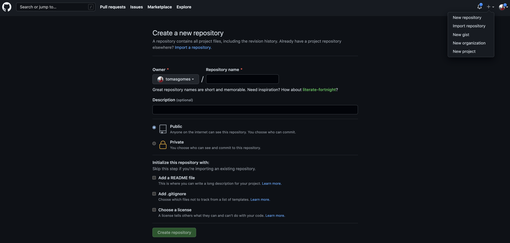
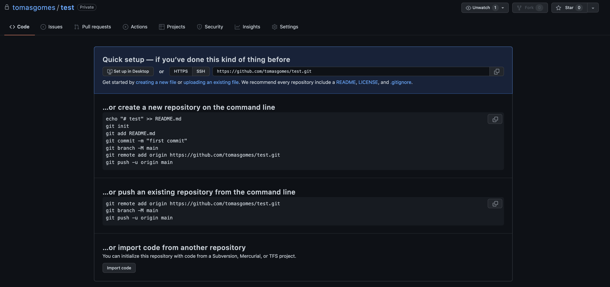
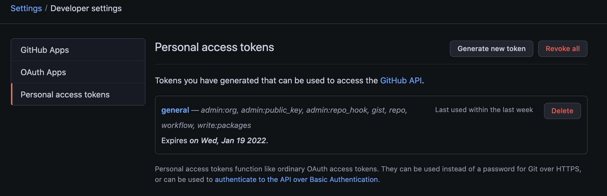

# Intro to version control using Git (and GitHub)  

When working on a project, it is important to keep track of its changes as we progress. Ideally, one should also store the most important files in an independent repository, in order to prevent losses due to storage issues, but also to improve sharing.  

One of the most widely used tools for this is Git. Git includes a variety of commands in order to control versioning of files in a directory, as well as annotating, merging, and sharing those files.  

Git works independently of [GitHub](https://github.com/) or [GitLab](https://about.gitlab.com/), but nowadays these are important parts of code sharing and maintenance.  

This tutorial will cover the basic commands of using Git through the terminal. It will also cover how to use Git within RStudio, and saving your projects to GitHub. The [Git Cheat Sheet from GitHub](https://education.github.com/git-cheat-sheet-education.pdf) may also be quite helpful. This will however not cover branches and pulling, which are other useful functions for collaborative projects.  
  
  

## Setup

A git repository can be created with `git init`. This will create a `.git` folder, where all project version changes will be tracked. In RStudio, git can be initialized by going to *Tools > Project Options > Git/SVN*.    

Alternatively, we might wish to start a project from a pre-existing one (hosted on GitHub, for example). This can be achieved with `git clone [url]`. This URL can be obtained from GitHub directly, where we can also download a zip file of the project.    
  

## Staging and committing

Saved files are not automatically added to the project's history. To do this, we first need to use `git add [file]`. This will "stage" the file, i.e. prepare it to be included in the next snapshot. Several files can be added at each snapshot. Conversely, a file can be "unstaged" by using `git reset [file]`. In RStudio, one can use the Git menu to add files (as well as other commands here discussed).    

This menu also shows you the "status" of the files. In the console, you can see this with `git status`, especially for the files that you have added but not yet commited to a snapshot. Committing a snapshot is done using `git commit -m "[descriptive message]"`. This will add all the "staged" files as a new snapshot. In RStudio, this is done by opening the Commit window in the Git menu.    

In this menu, we can add our commit description, see the projects "History" (all snapshots), and see below what changed in each file. In the present example, we see the whole file in green, since all that text is new and nothing was deleted.  

It is also possible that we may want to disregard certain files when doing version control. A common example of this is when we store data it the same directory as our code, since these datasets tend to be too large to keep (several) versions in the project's history. To not consider a file or directory for version control, we can add their name to the `.gitignore` file (since it is a hidden file, i.e. starts with ".", in the terminal requires `ls -a` to be listed). Everything listed here will not be considered for staging. When creating a Git project in RStudio, some files will be added to this list by default, since they do not require version control.  

Lastly, accidents happen. We may eventually find ourselves in a situation where a file that has been previously commited should have never been (e.g. very large files, files with sensitive/confidential data, files that end up turning too large like some Jupyter NB). And even when we delete the file from our current directory and commit that deletion, the former versions of the file will remain in the project's history. To remove these files and their full history, we can use `git-filter-repo` (`conda install git-filter-repo`). This will add an option to git to do just that, e.g. `git filter-repo --force --invert-paths --path some_file.txt`. It is also important to note that, on GitHub, files can only have up to 100Mb (50Mb recommended).   
  

## Pushing to GitHub

Now that a new snapshot has been committed, it is helpful to have our project stored in a remote repository, where it can be easily accessible. This is where GitHub comes in.  

First (and assuming you already have an account), you'll need to create a new project on GitHub (see "+" in top right corner).    

You can choose your project's name, add a description, and set it to Public (everyone can see) or Private (only visible to you). The latter option can be changed at a later time. Projects can also be archived once they are no longer intended to be changed. Other files can also be added; in general these will not be necessary if you're creating your project from RStudio. The README file is a markdown-format file that stays at the front of a project, giving viewers a basic description and other useful information about it.

Once you choose from the options described above and create your project, you'll be taken your project's front page. This will present you the options you have to start the project, or import an already existing one (this would be our case).    

Before we get to this, we have to give our local account authorization to make changes to our repositories on GitHub! To do this, you will create a [Personal Access Token](https://docs.github.com/en/authentication/keeping-your-account-and-data-secure/creating-a-personal-access-token). Go to your picture on the top right, and then Setting > Developer Settings > Personal access tokens.    

When asking for a new token, it should be sufficient to tag the "repo" option, in order to enable read/write access to your repositories, but other actions can be allowed. You can also choose for how long the token will work. Your token will then appear - you need to copy it since it will not be available again (though you can generate a new one)! However, for the period that it is active, you will only need to enter it once.

Now for the sincronization. The crucial is the command `git remote add origin [url]`, where `url` is the link to your new project on GitHub. This only needs to be done once, and will assign that url to your local project. After this, you can "push" your project to GitHub using `git push -u origin main`. At this stage you may be asked for your username (from GitHub), and password (that will be the Personal Access Token). For pushing, you can also use the "Push" option in RStudio's Git menu.  

And... congrats! You now uploaded your project to GitHub! Now remember to do this frequently so you have your code consistently backed up.

